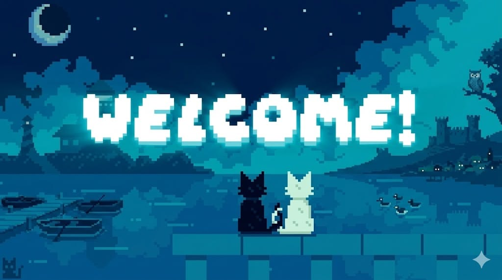

  

<h1 align="center">Hi 👋, I'm Fikri</h1>

<h3 align="center">
Software Engineer in Progress
</h3>

Building Software • Exploring AI • Creating Solutions

---

# 🚀 About Me

- 🎓 Information Systems Student
- 💻 Passionate about Software Engineering
- 🤖 Exploring Artificial Intelligence
- 🌐 Building Modern Web Applications
- 📚 Always learning new technologies
- 🚀 Goal: Become a Software Engineer

---

# 🌱 Currently Learning

- Backend Development
- Software Architecture
- Machine Learning
- Cloud Computing
- System Design

---

# 🛠 Tech Stack

### Languages

### Framework & Tools

### Database

---

# 🚀 Featured Projects

## 🥚 EggVision AI

AI-powered chicken egg detection using computer vision and Gemini AI.

---

## 📸 SI SnapStation

Interactive digital photobooth system for university events.

---

## 🌐 Portfolio Website

Personal portfolio showcasing projects and experiences.

---

# 📊 GitHub Analytics

---

# 🔥 GitHub Streak

---

# 📈 Contribution Graph

---

# 🐍 Contribution Snake

---

# 📫 Connect with Me

---

# 💡 Quote

> *"First, solve the problem. Then, write the code."*  
> **— John Johnson**

---

### Thanks for visiting! 👋

*"Code. Learn. Build. Repeat."*

⭐ If you like my projects, don't forget to leave a star.

